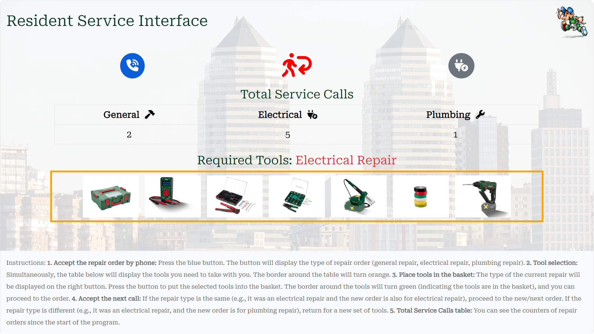
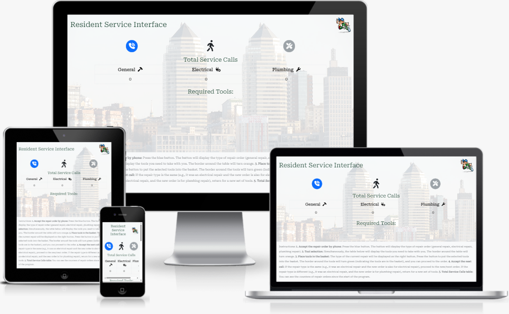
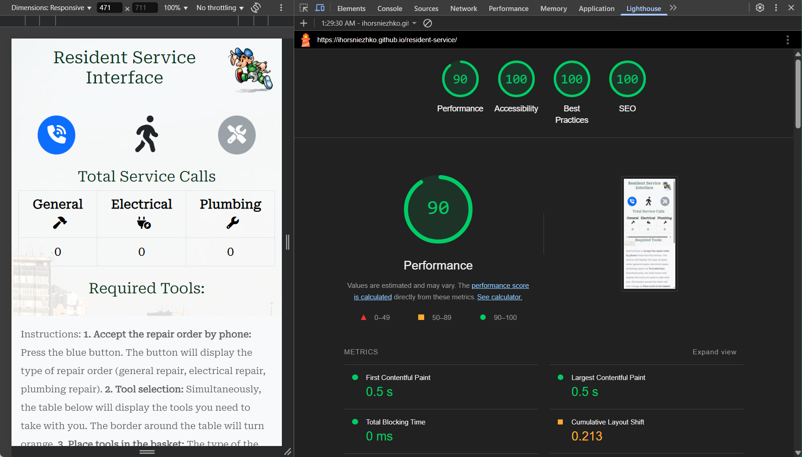

# Resident Service Interface (Simulation)

## Introduction
This README provides a comprehensive overview of the project, making it easy to understand and use the code.  It covers the purpose, features, how to run it, the technologies used, and the structure of the code.

## Project Overview
This project provides a simplified interface for a local service technician to manage different types of repairs. It simulates the process of receiving repair calls, displaying required tools, and visually representing the technician's status. This application aims to streamline the initial stages of the repair process by providing essential information to service dispatchers and technicians at the point of call acceptance. It is intended to help service dispatchers efficiently assign repair calls and allow technicians to quickly prepare for their jobs by knowing the necessary tools and tracking their productivity.

## Features

### Existing Features

*   **Simulated Call Receiving:** Clicking the phone icon button on the left side simulates receiving a new repair call. The type of repair (General, Electrical, or Plumbing) is randomly selected, and the button icon changes accordingly.
*   **Repair Type Indication:** The interface updates to display the type of repair order that needs to be addressed. The `repairTypeSpan` element is updated with the correct repair type text.
*   **Dynamic Tool Display:** Based on the repair type, the application dynamically displays images of the necessary tools in the `toolsContainer`. An orange border highlights the tools area when tools need to be selected.
*   **Tool "Packing":** Clicking the tools button on the right side (which changes icon to reflect repair type) simulates gathering the required tools. The border around the tools changes to green, indicating they are ready. The "Tools" button becomes disabled after being clicked.
*   **Technician Status Indicator:** A "walker" icon visually represents the technician's status:
    *   `fa-person-walking`: Initial state.
    *   `fa-person-walking-arrow-right` (green): Technician is going to the repair location when the repair type is the same as the previous call or after packing tools.
    *   `fa-person-walking-arrow-loop-left` (red): Technician is returning to base when a new call has a *different* repair type than the previous one.
*   **Repair Call Counter:** A table keeps track of the total number of General, Electrical, and Plumbing repair calls received during the session. The counters in the "Total Service Calls" table are incremented correctly.
*   **Responsive Design:** The website uses Bootstrap 5 for a responsive layout that adapts to different screen sizes.
*   **Clear Instructions:** Includes a footer with step-by-step instructions explaining how the interface works.
*   **No Persistent Storage:** All call type counters are reset when the page reloads.
*   **Resident Service Branding:** The interface displays a "Resident Service" logo at the top. The logo is hidden on small screens.

### Future Features

*   **Persistence of Data:** Implement local storage or a simple backend to allow the repair call counts to persist across sessions.
*   **Timer/Job Duration:** Add a timer to simulate the duration of a service call.
*   **More Detailed Repair Information:** Expand the repair information to include details such as the location of the repair, a description of the problem, and the urgency of the call.
*   **User Authentication:** For a more complex application, add user authentication to allow multiple users to use the system and track their individual performance.
*   **Floor Plan Integration:** Integrate a floor plan to visualize the location of the repair.
*   **Drag and Drop Functionality:** Enable drag-and-drop functionality to allow users to drag tools into a virtual "toolbox".

## Design Choices
*   The website uses a clean and responsive layout to ensure readability on all screen sizes.
*   Clear and consistent navigation is used to improve user experience.
*   The website design leverages the default Bootstrap 5 Light theme and Google Roboto Serif font. This choice creates a clean, bright, and approachable aesthetic.

## User Stories
*   **Service dispatcher:** wants to receive and process repair calls so they can be assigned to technicians efficiently.
*   **Technician:** wants to know the required tools for each repair so they can prepare for the job. Wants to track the number of repairs completed so they can monitor productivity.

## Balsamiq Wireframes

Balsamiq wireframes are low-fidelity, hand-drawn style digital sketches of the Resident Service website's layout used to plan the user interface. Balsamiq was chosen for its ability to quickly create and iterate on visual layouts, allowing for rapid design decisions and modifications.

*   The wireframes PDF file can be found [here](assets/media/resident-service-wireframes.pdf).
*   The Balsamiq wireframes BMPR file can be found [here](assets/media/resident-service-wireframes.bmpr).

## Technologies Used

*   HTML5
*   CSS3 (with Bootstrap 5)
    *   [Bootstrap 5.3.3](https://getbootstrap.com/)
*   JavaScript (Vanilla JS)
*   Font Awesome 6.7.2
    *   Icons used include `fa-person-walking`, `fa-person-walking-arrow-right`, `fa-person-walking-arrow-loop-left`, and potentially others within the call and tools buttons.
*   Google Roboto Serif font.

## Testing
*   **Functional Testing:**
    *   **Call Button Functionality:** Clicking the "Call" button changes the icon, updates the `repairTypeSpan`, displays correct tool images, changes the walker icon appropriately, and increments repair counts.
    *   **Tools Button Functionality:** Clicking the "Tools" button changes the tools container border to green, changes the walker icon to "going", and disables the "Tools" button.
    *   **Initial State Verification:** The "Tools" button is initially disabled, the walker icon is `fa-person-walking`, and repair counts are 0.
    *   **Workflow Testing:** Testing the complete workflow of receiving calls, packing tools, and handling subsequent calls of the same and different types.
*   **User Interface (UI) Testing:**
    *   **Layout and Responsiveness:** Verifying consistent layout and correct element positioning on different screen sizes. Checking responsiveness across various viewports.
    *   **Visual Element Verification:** Inspecting font, colors, icons, and images for correct and consistent display. Verifying the logo is hidden on small screens.
    *   **Navigation:** Ensuring interactive elements are easy to identify and use.
*   **Usability Testing:**
    *   **Ease of Use:** Assessing the ease of understanding and using features. Evaluating the clarity of instructions in the footer.
*   **Accessibility Testing:** Ensures accessibility for users with disabilities.
    *   **Keyboard Navigation:** Testing if the application is fully navigable by keyboard and checking focus order.
    *   **Screen Reader Compatibility:** Evaluating compatibility and ensuring appropriate alternative text and ARIA attributes.
*   **Lighthouse Report:**

    
*   **Validator Testing:**
    *   **HTML:** No errors were returned when passing through the official [W3C validator](https://validator.w3.org/nu/?doc=https%3A%2F%2Fihorsniezhko.github.io%2Fresident-service%2F).
    *   **CSS:** No errors were found when passing through the official [(Jigsaw) validator](https://jigsaw.w3.org/css-validator/validator?uri=https%3A%2F%2Fihorsniezhko.github.io%2Fresident-service%2F&profile=css3svg&usermedium=all&warning=1&vextwarning=&lang=en).
    *   **JavaScript:** No errors were found when passing through the official [Jshint validator](https://jshint.com/).
        *   Metrics returned: 7 functions in this file. Function with the largest signature take 1 arguments, while the median is 1. Largest function has 13 statements in it, while the median is 5. The most complex function has a cyclomatic complexity value of 4 while the median is 2.

### Bugs

*   In the JShint validator test, one unused variable was found and removed.
*   Logical error in the handleCall() function. If the new repair type was the same as the current repair type, the Tools button was still enabled. This should not happen as the toolset remains the same. The bug has been fixed.

At this stage, there are no other explicitly identified unfixed bugs.

## Deployment

The website was deployed to GitHub Pages using the following steps:

1.  In the GitHub repository, navigate to the **Settings** tab.
2.  From the **Pages** side menu, **Branch** section drop-down menu, select the **Main** and press **Save**.

The live link can be found [here](https://ihorsniezhko.github.io/resident-service/).

## Credits
### Media
*   Site Logo Image, Favicons: [Pngegg](https://www.pngegg.com/en/png-yxixz/)
*   Body Background Image - Panorama of Dnipro city, Ukraine: [Wikipedia](https://commons.wikimedia.org/wiki/File:Bashty_Gora_Kaminnya_Sobornyj_rajon_Dnipro-city_-_panoramio.jpg#file)
*   Images of Parkside repair tools: [Lidl's Parkside section](https://www.lidl.de/c/parkside-du-packst-das/s10026759).
*   The images were edited with [ThechSmith Snagit Editor](https://www.techsmith.com/snagit/).

### Resources

*   **Javascript:**
    *   Math functions: [MDN](https://developer.mozilla.org/en-US/docs/Web/JavaScript/Reference/Global_Objects/Math).
    *   Arrow function: [MDN](https://developer.mozilla.org/en-US/docs/Web/JavaScript/Reference/Functions/Arrow_functions).
    *   Switch Case: [MDN](https://developer.mozilla.org/en-US/docs/Web/JavaScript/Reference/Statements/switch).
    *   Conditional (ternary) operator: [MDN](https://developer.mozilla.org/en-US/docs/Web/JavaScript/Reference/Operators/Conditional_operator).
    *   ClassList property: [MDN](https://developer.mozilla.org/en-US/docs/Web/API/Element/classList).
*   **Other:**
    *   [Stack Overflow](https://stackoverflow.com/).
    *   [Bootstrap](https://getbootstrap.com/docs/5.3/getting-started/introduction/).

### Content

*   The structure are based on the requirements of a Resident Service interface for taking repair calls.
*   Instructions for the user are provided directly within the HTML.